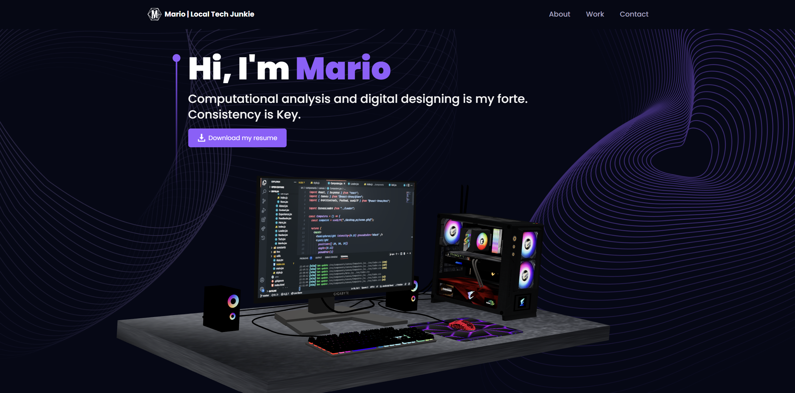
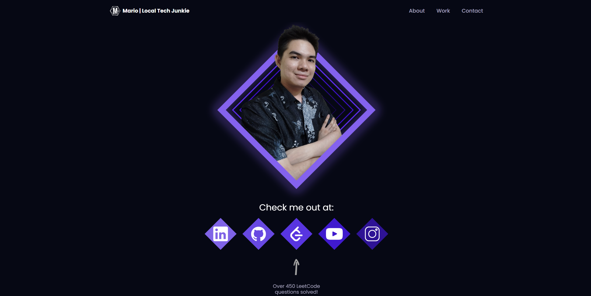
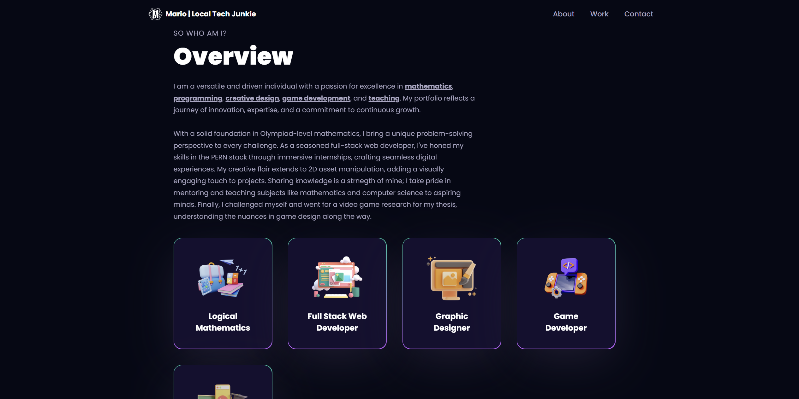
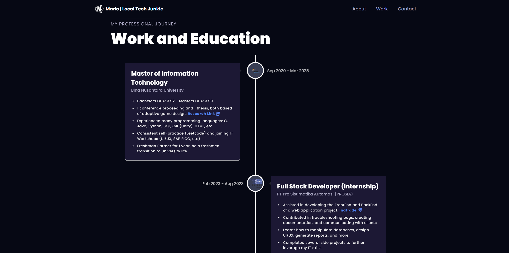
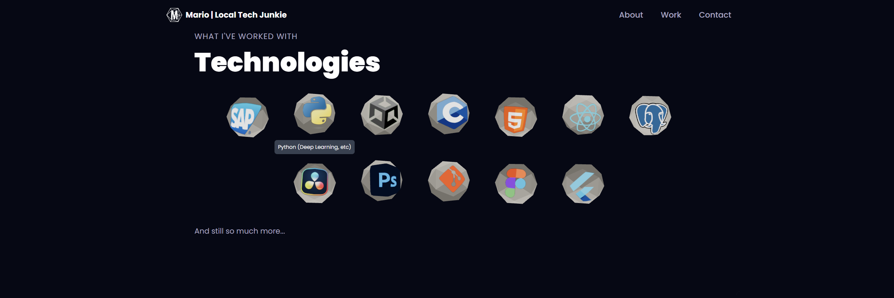
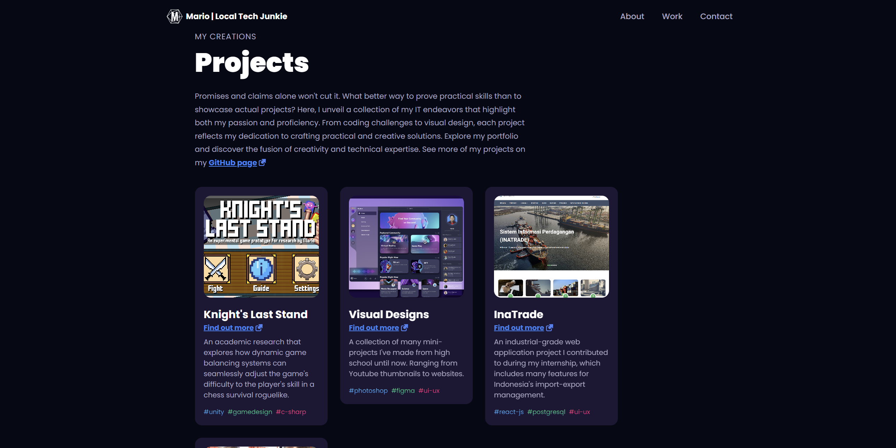
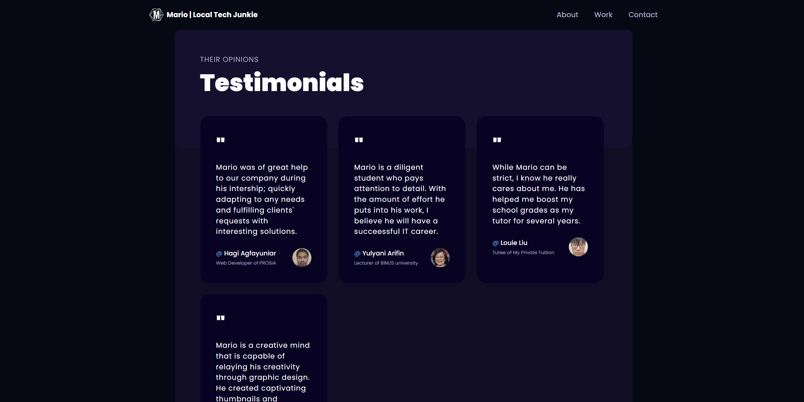
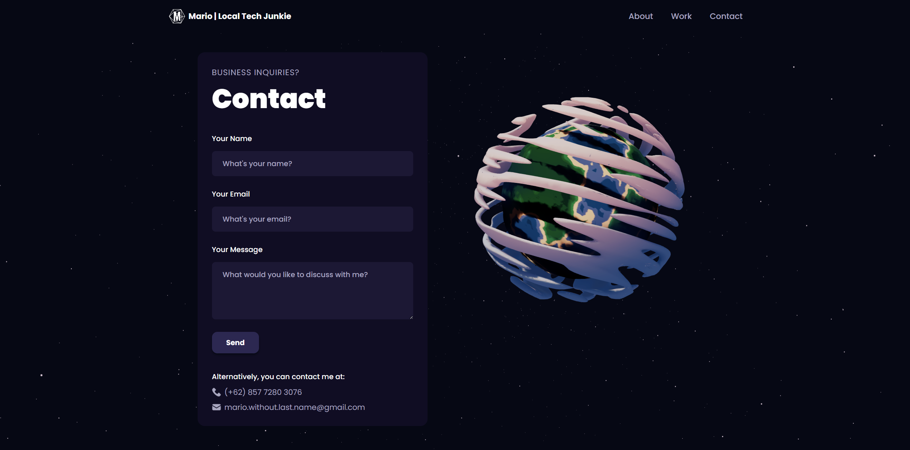
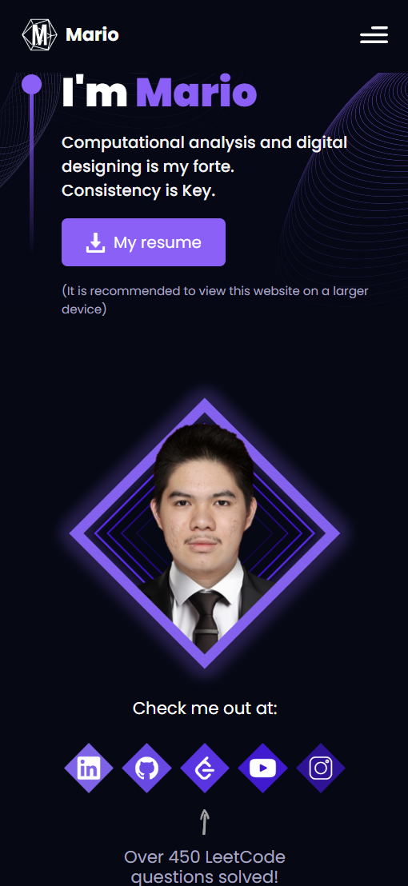

# 3D Portfolio

My official portfolio project to showcase some of my skills on the web.
It's the one I use when applying for jobs.

Project made by Mario.

---

Some screenshots:

Works on mobile too:

